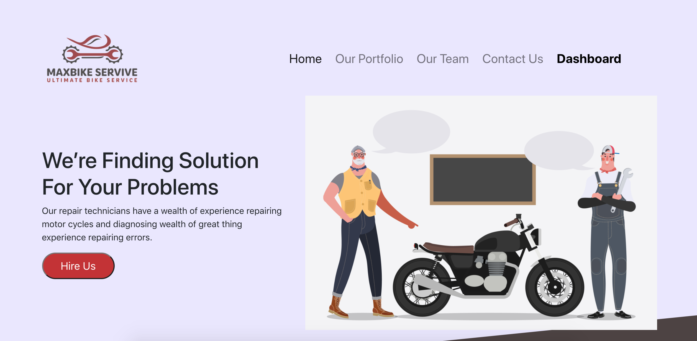
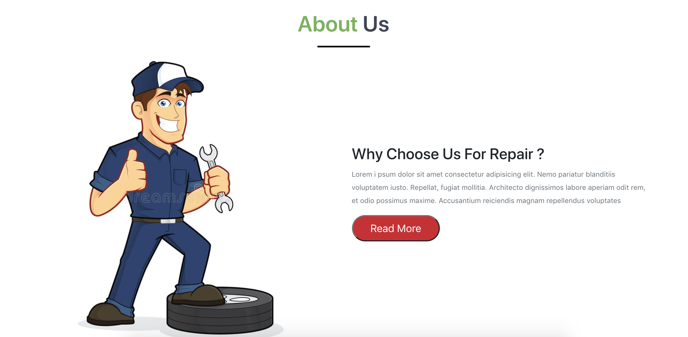
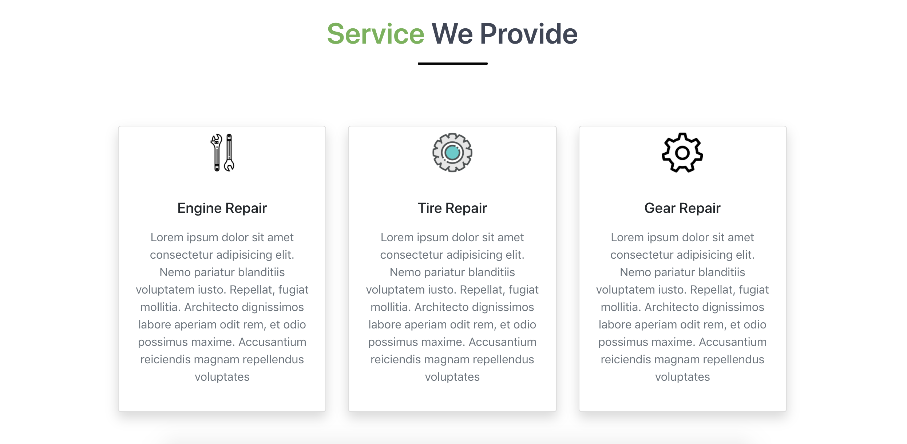
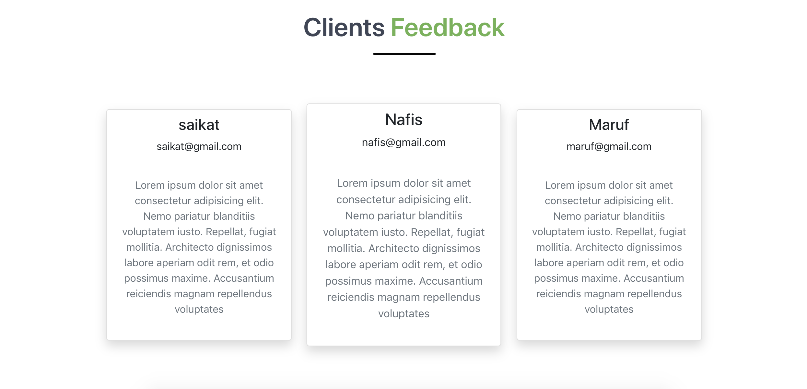
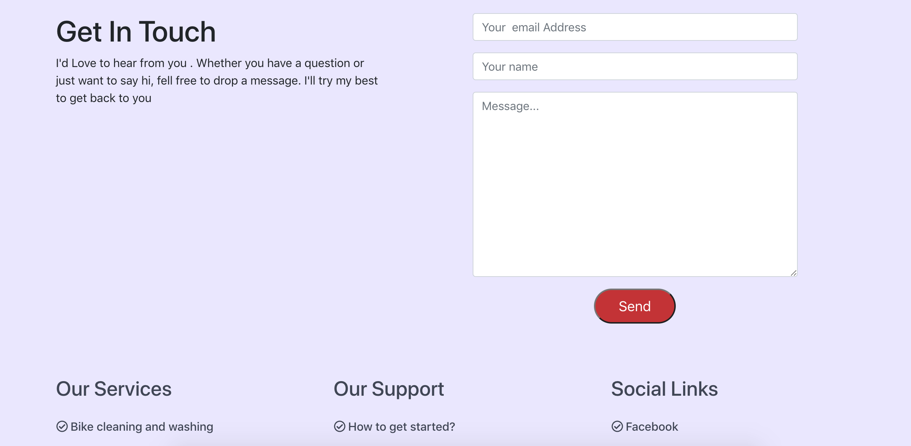
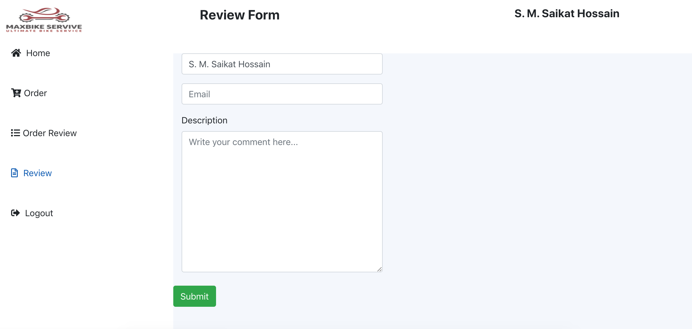
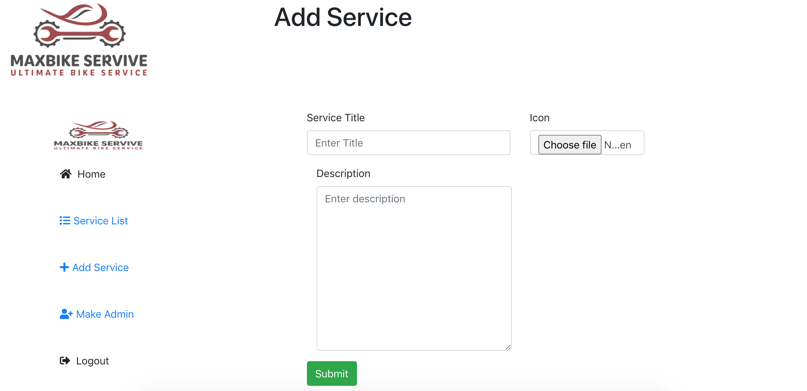
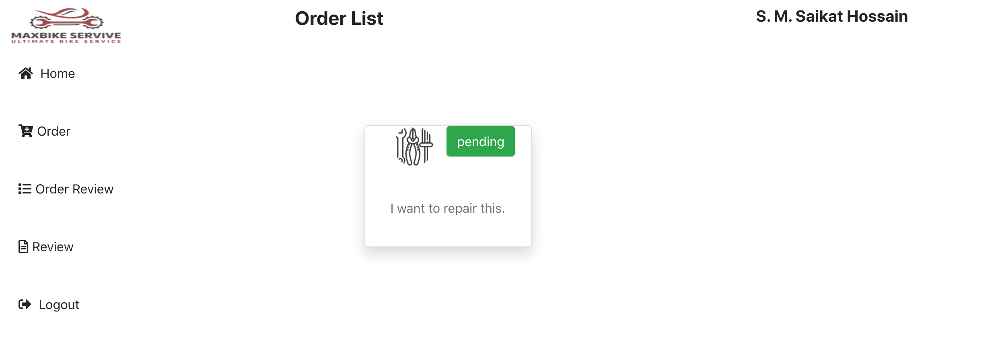
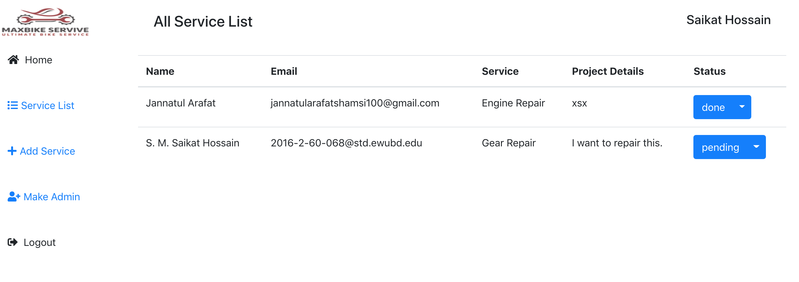

## Max Bike Repair

### About This Site:

- This is a Responsive MERN-Stack web applications for motorcycle parts repair.
- In this site user can take our service, see his order list & reviews our site. 
- If user want any services he must be authenticate with gmail or google. 
- User can also cancelled his order. But he/she can't cancel his first order. If he/she want to cancel his order he need to order more then one services. 
- There is a admin panel where admin can add more admins,  add more services,  update order condition of users.

### Front-End Technology:

- React.JS
- Javascript
- React Router Dom
- Firebase Authentication
- React Hook From
- React Bootstrap 
- HTML5
- CSS3

### Back-End Technology:

- Node.Js
- Express.JS
- MongoDB

### Tools:
- VS CODE
- Git
- GitHub
- Dotenv

## Screenshots

